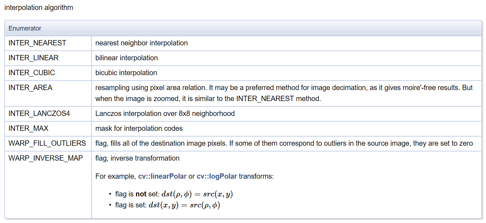
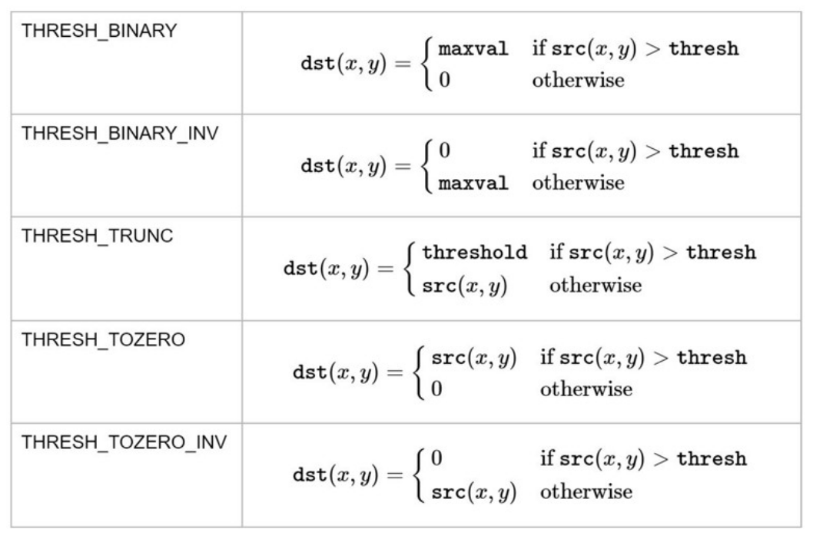
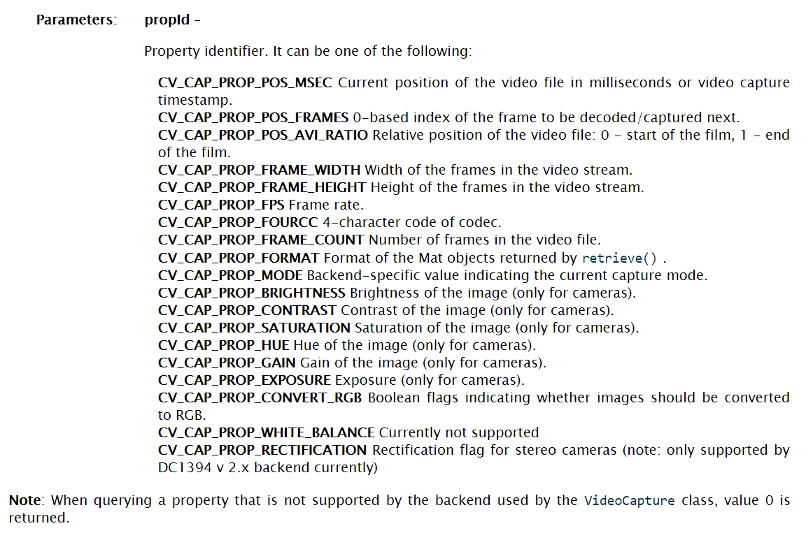

## OpenCV
* ## 基本操作
```
img = cv2.imread(r'1.jpg') # 读取图像
cv2.namedWindow("Image",cv2.WINDOW_NORMAL) # 新建一个名字为'Image'的窗口
cv2.imshow("Image", img) # 显示图像
cv2.imwrite('new_img.jpg', img) # 保存图像
cv2.waitKey (0)  
cv2.destroyAllWindows()  
```
> OpenCV中的图像是以BGR的通道顺序存储的  
可以如下翻转 new_img = img[:, :, ::-1]

* ## 通道分割与合并
```
b, g, r = cv2.split(img)
img = cv2.merge((b, g, r))
```
* ## 图片变换
#### 缩放图片
```
res = cv2.resize(img, (800, 600))
res2 = cv2.resize(img, None, fx=2, fy=2, interpolation=cv2.INTER_LINEAR)
```
插值方法

#### 平移图片
```
# x轴平移100，y轴平移50
M = np.float32([[1, 0, 100], [0, 1, 50]])
# 用仿射变换实现平移
dst = cv2.warpAffine(img, M,(cols, rows))
```
(cols, rows)为得到的图片的大小
#### 旋转图片
```
# 45°旋转图片并缩小一半
M = cv2.getRotationMatrix2D((cols / 2, rows / 2), 45, 0.5)
dst = cv2.warpAffine(img, M, (cols, rows))
```
#### 翻转图片
```
img = cv2.flip(img,0) # 垂直翻转
img = cv2.flip(img,1) # 水平翻转
```
#### 仿射变换
三个点确定变换
```
# 变换前的三个点
pts1 = np.float32([[50, 65], [150, 65], [210, 210]])
# 变换后的三个点
pts2 = np.float32([[50, 100], [150, 65], [100, 250]])
# 生成变换矩阵
M = cv2.getAffineTransform(pts1, pts2)
dst = cv2.warpAffine(img, M, (cols, rows))
```
#### 四点透视变换
```
# 原图中卡片的四个角点
pts1 = np.float32([[148, 80], [437, 114], [94, 247], [423, 288]])
# 变换后分别在左上、右上、左下、右下四个点
pts2 = np.float32([[0, 0], [320, 0], [0, 178], [320, 178]])
# 生成透视变换矩阵
M = cv2.getPerspectiveTransform(pts1, pts2)
# 进行透视变换
dst = cv2.warpPerspective(img, M, (cols, rows))
```
* ## 颜色空间转换
```
gray = cv2.cvtColor(frame, cv2.COLOR_BGR2GRAY)
hsv = cv2.cvtColor(frame, cv2.COLOR_BGR2HSV)
```
* ## 阈值分割
```
# 固定阈值
ret, thd = cv2.threshold(img, 127, 255, cv2.THRESH_BINARY)
# 自适应阈值
th2 = cv2.adaptiveThreshold(img, 255, cv2.ADAPTIVE_THRESH_MEAN_C, cv2.THRESH_BINARY, 11, 4)
```
阈值的几个参数
  
自适应阈值的几个参数
 * 参数1：要处理的原图
 * 参数2：最大阈值，一般为255
 * 参数3：小区域阈值的计算方式
   * ADAPTIVE_THRESH_MEAN_C：小区域内取均值
   * ADAPTIVE_THRESH_GAUSSIAN_C：小区域内加权求和，权重是个高斯核
 * 参数4：阈值方式（参考上面的图）
 * 参数5：小区域的面积，如11就是11*11的小块
 * 参数6：最终阈值等于小区域计算出的阈值再减去此值

* ## 绘图功能
```
# 画一条线宽为5的蓝色直线，参数2：起点，参数3：终点
cv2.line(img, (0, 0), (512, 512), (255, 0, 0), 5)
# 画一个绿色边框的矩形，参数2：左上角坐标，参数3：右下角坐标
cv2.rectangle(img, (384, 0), (510, 128), (0, 255, 0), 3)
# 画一个填充红色的圆，参数2：圆心坐标，参数3：半径
cv2.circle(img, (447, 63), 63, (0, 0, 255), -1)
```
* ### 画椭圆
 * 参数2：椭圆中心(x,y)
 * 参数3：x/y轴的长度
 * 参数4：angle–椭圆的旋转角度
 * 参数5：startAngle–椭圆的起始角度
 * 参数6：endAngle–椭圆的结束角度  
```
cv2.ellipse(img, (256, 256), (100, 50), 0, 0, 180, (255, 0, 0), -1)
```
* ## 画多边形
```
# 定义四个顶点坐标
pts = np.array([[10, 5],  [50, 10], [70, 20], [20, 30]], np.int32)
# 顶点个数：4，矩阵变成4*1*2维
pts = pts.reshape((-1, 1, 2))
cv2.polylines(img, [pts], True, (0, 255, 255))
```
cv2.polylines()的参数3如果是False的话，多边形就不闭合。
* ### 添加文字
 * 参数2：要添加的文本
 * 参数3：文字的起始坐标（左下角为起点）
 * 参数4：字体
 * 参数5：文字大小（缩放比例）
 * 参数6：文字颜色
 * 参数7：字体粗细
 * 参数8：LineTypes
```
font = cv2.FONT_HERSHEY_SIMPLEX
cv2.putText(img, 'ex2tron', (10, 500), font,4, (255, 255, 255), 2, lineType=cv2.LINE_AA)
```
* ## 图片滤波
```
# 均值滤波
cut = cv2.blur(image, (3,3))
```
当可选参数normalize为True的时候，方框滤波就是均值滤波  
normalize为False的时候，a=1，相当于求区域内的像素和
```
# 方框滤波
cut = cv2.boxFilter(image, -1, (3, 3), normalize=True)
```
```
# 高斯滤波
cut = cv2.GaussianBlur(image,ksize,sigmaX)
```
参数sigmaX值越大，模糊效果越明显
```
# 中值滤波
cut = cv2.medianBlur(image, 5)
```
```
# 双边滤波
cut = cv2.bilateralFilter(image,d,sigmaColor,sigmaSpace)
```
* ## 边缘检测
```
edge = cv2.Canny(image, threshold1, threshold2[, edges[, apertureSize[, L2gradient ]]])
```
* ## Harris角探测器
IMG输入图像，应该是灰度和浮动32型
```
gray = cv2.cvtColor(img,cv2.COLOR_BGR2GRAY)
gray = np.float32(gray)
dst = cv2.cornerHarris(gray,2,3,0.04)
#result is dilated for marking the corners, not important
dst = cv2.dilate(dst,None)
# Threshold for an optimal value, it may vary depending on the image.
img[dst>0.01*dst.max()]=[0,0,255] # 映射到图片
```
* ## Shi-tomasi角探测器
找到25个最佳的拐角例子
```
corners = cv2.goodFeaturesToTrack(gray,25,0.01,10)
corners = np.int0(corners)
for i in corners:
    x,y = i.ravel()
    cv2.circle(img,(x,y),3,255,-1)
```
* ## SIFT
```
sift = cv2.xfeatures2d.SIFT_create()
kp = sift.detect(gray,None)
img=cv2.drawKeypoints(gray,kp,img)
#img=cv2.drawKeypoints(gray,kp,img,flags=cv2.DRAW_MATCHES_FLAGS_DRAW_RICH_KEYPOINTS)
```

## 视频处理
### 捕获视频
```
cap = cv2.VideoCapture(0)

# 关闭
cap.release()
# cv2.destroyAllWindows()
```
若传入视频文件路径则读取视频文件，若传入数字比如0，则读取计算机的第一个摄像头
### 视频参数
```
prop = cap.get(propId) # 得到视频的一项参数
cap.set(propId,value)  # 设置参数
```
propId具体如下(顺序对应Id):  

### 得到视频每一帧
```
while(cap.isOpened()):
    ret, frame = cap.read()
    if ret == true:

        #tackle per frame

        if cv2.waitKey(1) & 0xFF == ord('q'):
            break
    else:
        break
```
### 保存视频
```
width = int(cap.get(3))
height = int(cap.get(4))
fps = int(cap.get(5))

fourcc = cv2.VideoWriter_fourcc(*'XVID')
out = cv2.VideoWriter('output.mp4',fourcc, fps, (width,height))

while(cap.isOpened()):
    ret, frame = cap.read()
    if ret == true:
        out.write(frame)
        if cv2.waitKey(1) & 0xFF == ord('q'):
            break
    else:
        break
cap.release()
out.release()
cv2.destroyAllWindows()
```
