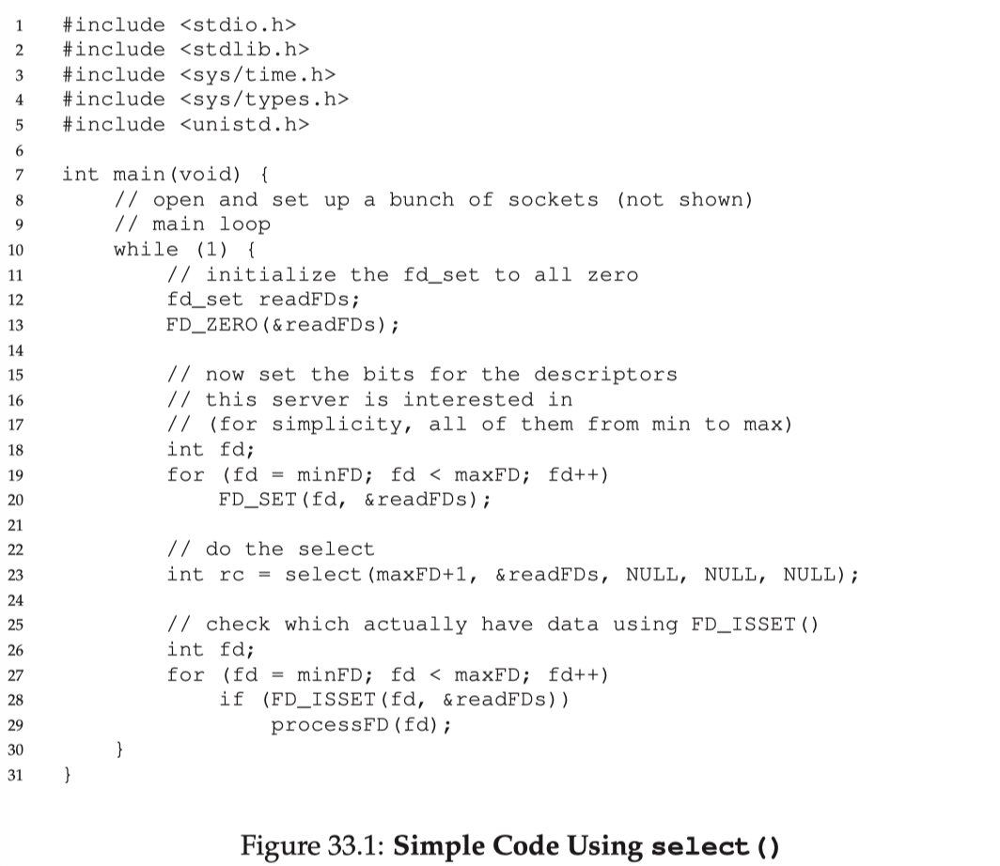
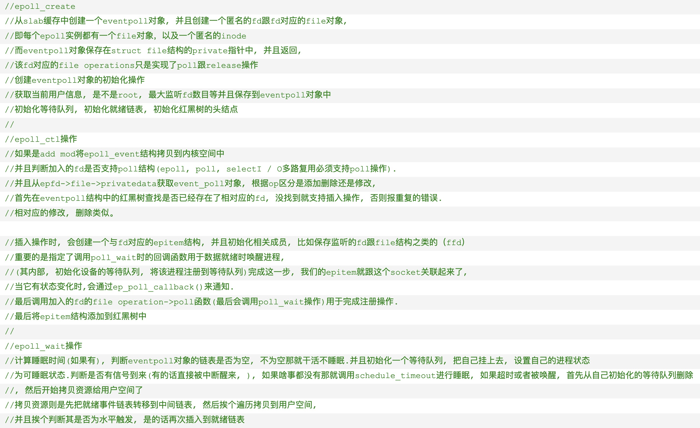

## TCP四个计时器

**重传计时器(Retransmission Timer)：**

**目的**：为了控制丢失的报文段或者丢弃的报文段。这段时间为对报文段的等待确认时间。
**创建时间**：在TCP发送报文段时，会创建对次特定报文段的重传计时器。
可能发生的两种情况：在截止时间（通常为60秒）到之前，已经收到了对此特定报文段的确认，则撤销计时器；在截止时间到了，但为收到对此特定报文段的确认，则重传报文段，并且将计时器复位。
**重传时间**：2*RTT（Round Trip Time，为往返时间）

---

**坚持计时器(Persistent Timer)：**

**目的**：主要解决零窗口大小通知可能导致的死锁问题
死锁问题的产生：当接收端的窗口大小为0时，接收端向发送端发送一个零窗口报文段，发送端即停止向对端发送数据。此后，如果接收端缓存区有空间则会重新给发送端发送一个窗口大小，即窗口更新。但接收端发送的这个确认报文段有可能会丢失，而此时接收端不知道已经丢失并认为自己已经发送成功，则一直处于等待数据的状态；而发送端由于没有收到该确认报文段，就会一直等待对方发来新的窗口大小，这样一来，双方都处在等待对方的状态，这样就形成了一种死锁问题。如果没有应对措施，这种局面是不会被打破的。为了解决这种问题，TCP为每一个连接设置了坚持计时器。
**工作原理**：当发送端TCP收到接收端发来的零窗口通知时，就会启动坚持计时器。当计时器的期限到达时，发送端就会主动发送一个特殊的报文段告诉对方确认已经丢失，必须重新发送。【这个特殊的报文段就称为探测报文段，探测报文段只有1个字节的大小，里边只有一个序号，该序号不需要被确认，甚至在计算其他部分数据的确认时该序号会被忽略。】
**截止期的设置**：设置为重传时间的值。但如果没有收到接收端的响应，则会发送另一个探测报文段，并将计时器的值加倍并复位，直到大于门限值（一般为60秒）。在此之后，发送端会每隔60秒发送一个探测报文段，直到窗口重新打开。

---

**保活计时器(Keeplive Timer)：**

**目的**：主要是为了防止两个TCP连接出现长时间的空闲。当客户端与服务器端建立TCP连接后，很长时间内客户端都没有向服务器端发送数据，此时很有可能是客户端出现故障，而服务器端会一直处于等待状态。保活计时器就是解决这种问题而生的。
**工作原理**：每当服务器端收到客户端的数据时，都将保活计时器重新设置（通常设置为2小时）。过了2小时后，服务器端如果没有收到客户端的数据，会发送探测报文段给客户端，并且每隔75秒发送一个，当连续发送10次以后，仍没有收到对端的来信，则服务器端认为客户端出现故障，并会终止连接。

---

**时间等待计时器(Time_Wait Timer)：**

**目的**：时间等待计时器是在连接终止期间使用的。

当TCP关闭连接时并不是立即关闭的，在等待期间，连接还处于过渡状态。这样就可以使重复的FIN报文段在到达终点之后被丢弃。

**时间设置**：一般为报文段寿命期望值MSL(Maximum Segment Lifetime)的2倍。

#### UDP包最大值

以太网EthernetII最大的数据帧是1518Bytes

刨去以太网帧的帧头（DMAC目的MAC地址48bits=6Bytes+SMAC源MAC地址48bits=6Bytes+Type域2Bytes）14Bytes和帧尾CRC校验部分4Bytes那么剩下承载上层协议的地方也就是Data域最大就只能有1500Bytes这个值我们就把它称之为MTU。

UDP 包的大小就应该是 1500 - IP头(20) - UDP头(8) = 1472(Bytes)

鉴于Internet(非局域网)上的标准MTU值为576字节，所以建议在进行Internet的UDP编程时，最好将UDP的数据长度控制在548字节 (576-8-20)以内

## 三次握手&四次挥手

* ACK位除了**主动打开的SYN**（一般是client）报文，皆为1，皆有
* ack永远为上一个收到报文的seq+1
* seq永远为上一个收到报文的ack

## 重传机制

* **超时重传**

  超过RTO（Retransmission Timeout）未得到确认则重传

* **快速重传**

  以**数据**为驱动而非**时间**，连续收到3个重复ACK则立即重传

* **SACK（Selective Acknowledge）**

  **快速重传**不知道该重传之前的**一个**还是**所有**

  在TCP头部选项字段加入SACK，将**缓存的地图**发送给发送方

* **D-SACK（Duplicate SACK）**

  使用SACK告诉对方哪些数据已经被**重复接收**了

## 拥塞控制

#### 慢启动

初始化`cwnd`一个`MSS`大小，每收到一个ACK则**翻倍**，指数增直到`cwnd == ssthresh`

#### 拥塞避免

当`cwnd`超过ssthresh(slow start threshold)后，每收到一个ACK则**+1**，线性增长

#### 拥塞发生

当发生「超时重传」：

```python
ssthresh = cwnd/2
cwnd = 1
// 进入慢启动
```


当发生「快速重传」则使用「快速恢复」:


#### 快速恢复

```python
ssthresh = cwnd
cwnd = ssthresh + 3 // 收到3个重复ACK
// 进入拥塞避免
```

## Nagle算法

* 上一个分组**得到确认**才会发送下一个分组
* 整合**长度小于SMSS**的数据到一个报文段

* 与**延时ACK**会发生死锁（非永久），需关闭Nagle，大多数交互式应用都如此

## 粘包

#### 原因:

* **多个进程**公用一个**TCP连接**，多种**不同数据结构**进行流式传输，边界分割会有问题
* **数据包**过大超过**发送区缓存**大小，一部分已经发送并**被接收**，一部分可能才**刚放进**发送缓存区
* 接收方**不及时接收**缓冲区的包，造成多个包的接收
* 流量控制，拥塞控制
* Nagle算法导致

#### 解决：

* 关闭Nalge
* **TCP头部**加上**数据长度**
* **应用层**自己解决

## HTTP over TSL

```sequence
	Client -> Server:"client hello",字符串cr\n可用的加密算法和压缩算法,TLS版本,
	Server -> Client:"server hello",字符串sr\n所用加密算法和压缩算法,证书及其公钥
	Client -> Client:验证证书\n有问题则警告用户
	Client -> Server:证书公钥加密后的随机\n字符串pr
	Server -> Server:私钥解密prandom\n根据cr,sr,p\n生成对称主密钥
	Client -> Client:根据cr,sr,pr生成对称主密钥KEY
	Client -> Server:KEY加密的"finished"
	Server -> Server:生成hash\n查是否对应
	Server -> Client:KEY加密的"finished"
```

## 浏览器输入网址到获得页面过程

* 浏览器缓存中查找DNS
* 操作系统缓存中查找DNS
* 检查本地域名解析文件`hosts`是否有
* 向**本地域名服务器**发起DNS请求
* 本地DNS服务器没有，检查本地DNS服务器缓存
* **本地DNS服务器**访问**根域名服务器**递归查询
* 浏览器获得域名对应的IP地址以后，浏览器向服务器请求建立链接，发起TCP三次握手
* TSL握手
* 服务器根据请求进行处理计算，将结果返回给浏览器
* 浏览器解析，遇到静态资源引用则继续向服务器请求这些资源
* 渲染界面

## IO多路复用

I/O多路复用就是通过一种机制，一个进程可以监视多个文件描述符，一旦某个描述符就绪（读就绪或写就绪），能够通知程序进行相应的读写操作

### `Select`:

**函数声明：**

```c
int select(int nfds,
            fd_set *restrict readfds,
            fd_set *restrict writefds,
            fd_set *restrict errorfds,
            struct timeval *restrict timeout);
```

`readfds`、`writefds`、`errorfds` 是三个文件描述符集合。`select` 会遍历每个集合的前 `nfds` 个描述符，分别找到「可以读取」、「可以写入」、「发生错误」的描述符，统称为「就绪」的描述符。然后用找到的子集替换参数中的对应集合，返回所有就绪描述符的总数。

`timeout` 参数表示调用 `select` 时的阻塞时长。如果所有文件描述符都未就绪，就阻塞调用进程，直到某个描述符就绪，或者阻塞超过设置的`timeout`后，返回。

* 如果 `timeout` 参数设为 NULL，会无限阻塞直到某个描述符就绪
* 如果 `timeout` 参数设为 0，会立即返回，不阻塞。

>每个进程默认都有 3 个文件描述符：0 (stdin)、1 (stdout)、2 (stderr)

**fd_set 文件描述符集合**

由于文件描述符 `fd` 是一个从 0 开始的无符号整数，所以可以使用 `fd_set` 的**二进制每一位**来表示一个文件描述符。某一位为 1，表示对应的文件描述符已就绪。

`fd_set` 的使用涉及以下几个 API：

```c
#include <sys/select.h>   
int FD_ZERO(int fd, fd_set *fdset);  // 将 fd_set 所有位置 0
int FD_CLR(int fd, fd_set *fdset);   // 将 fd_set 某一位置 0
int FD_SET(int fd, fd_set *fd_set);  // 将 fd_set 某一位置 1
int FD_ISSET(int fd, fd_set *fdset); // 检测 fd_set 某一位是否为 1
```

**select 使用示例**



* 性能开销大

  1. 调用 `select` 时会陷入内核，这时需要将参数中的 `fd_set` 从用户空间拷贝到内核空间
  2. 内核需要遍历传递进来的所有 `fd_set` 的每一位，不管它们是否就绪

* 同时能够监听的文件描述符数量太少。受限于 `sizeof(fd_set)` 的大小，在编译内核时就确定了且无法更改。一般是 1024，不同的操作系统不相同

  见`/usr/include/linux/posix_types.h`:

  ```c
  /*
   * This allows for 1024 file descriptors: if NR_OPEN is ever grown
   * beyond that you'll have to change this too. But 1024 fd's seem to be
   * enough even for such "real" unices like OSF/1, so hopefully this is
   * one limit that doesn't have to be changed [again].
   *
   * Note that POSIX wants the FD_CLEAR(fd,fdsetp) defines to be in
   * <sys/time.h> (and thus <linux/time.h>) - but this is a more logical
   * place for them. Solved by having dummy defines in <sys/time.h>.
   */
  
  /*
   * This macro may have been defined in <gnu/types.h>. But we always
   * use the one here.
   */
  #undef __FD_SETSIZE
  #define __FD_SETSIZE    1024
  ```

### `Poll`:

**函数声明：**

```c
struct pollfd {
    int fd; /* file descriptor */
    short events; /* requested events to watch */
    short revents; /* returned events witnessed */
};

// 用户态传入数组，内核是链表
int poll(struct pollfd *fds, nfds_t nfds,int timeout); 
```

* poll 和 select 几乎没有区别。poll 采用链表的方式存储文件描述符，没有最大存储数量制

* 从性能开销上看，poll 和 select 的差别不大

### `Epoll`:

epoll 是对 select 和 poll 的改进，避免了**「性能开销大」**和**「文件描述符数量少」**两个缺点。

简而言之，epoll 有以下几个特点：

- 使用**红黑树**存储文件描述符集合
- 使用**队列**存储就绪的文件描述符
- 每个文件描述符只需在添加时传入一次；通过事件更改文件描述符状态

select、poll 模型都只使用一个函数，而 epoll 模型使用三个数：

`epoll_create`、`epoll_ctl` 和 `epoll_wait`。

#### epoll_create

```c
int epoll_create(int size);
```

`epoll_create` 会创建一个 `epoll` 实例，同时返回一个引用该实例的文件描述符。

返回的文件描述符仅仅指向对应的 `epoll` 实例，并不表示真实的磁盘文件节点。其他 API 如 `epoll_ctl`、`epoll_wait` 会使用这个文件描述符来操作相应的 `epoll` 实例。

当创建好 epoll 句柄后，它会占用一个 fd 值，在 linux 下查看 `/proc/进程id/fd/`，就能够看到这个 fd。所以在使用完 epoll 后，必须调用 `close(epfd)` 关闭对应的文件描述符，否则可能导致 fd 被耗尽。当指向同一个 `epoll` 实例的所有文件描述符都被关闭后，操作系统会销毁这个 `epoll` 实例。

`epoll` 实例内部存储：

- 监听列表：所有要监听的文件描述符，使用红黑树
- 就绪列表：所有就绪的文件描述符，使用链表

#### epoll_ctl

```c
int epoll_ctl(int epfd, int op, int fd, struct epoll_event *event);
```

参数说明：

- `epfd` 即 `epoll_create` 返回的文件描述符，指向一个 `epoll` 实例
- `fd` 表示要监听的目标文件描述符
- `event` 表示要监听的事件（可读、可写、发送错误…）
- `op` 表示要对 `fd` 执行的操作，有以下几种：
  - `EPOLL_CTL_ADD`：为 `fd` 添加一个监听事件 `event`
  - `EPOLL_CTL_MOD`：Change the event event associated with the target file descriptor fd（`event` 是一个结构体变量，这相当于变量 `event` 本身没变，但是更改了其内部字段的值）
  - `EPOLL_CTL_DEL`：删除 `fd` 的所有监听事件，这种情况下 `event` 参数没用

返回值 0 或 -1，表示上述操作成功与否。

`epoll_ctl` 会将文件描述符 `fd` 添加到 `epoll` 实例的监听列表里，同时为 `fd` 设置一个回调函数，并监听事件 `event`。当 `fd` 上发生相应事件时，会调用回调函数，将 `fd` 添加到 `epoll` 实例的就绪队列上。

#### epoll_wait

```c
int epoll_wait(int epfd, struct epoll_event *events,
               int maxevents, int timeout);
```

这是 epoll 模型的主要函数，功能相当于 `select`。

参数说明：

- `epfd` 即 `epoll_create` 返回的文件描述符，指向一个 `epoll` 实例
- `events` 是一个数组，保存就绪状态的文件描述符，其空间由调用者负责申请
- `maxevents` 指定 `events` 的大小
- `timeout` 类似于 `select` 中的 timeout。如果没有文件描述符就绪，即就绪队列为空，则 `epoll_wait` 会阻塞 timeout 毫秒。如果 timeout 设为 -1，则 `epoll_wait` 会一直阻塞，直到有文件描述符就绪；如果 timeout 设为 0，则 `epoll_wait` 会立即返回

返回值表示 `events` 中存储的就绪描述符个数，最大不超过 `maxevents`。

##### 操作流程

来自于[epoll源码解析](https://www.cnblogs.com/l2017/p/10830391.html)

认为`epoll`并没有用到`mmap`



#### epoll优点

避免了「性能开销大」和「文件描述符数量少」两个缺点

对于「文件描述符数量少」，select 使用整型数组存储文件描述符集合，而 epoll 使用红黑树存储，数量较大。

对于「性能开销大」，`epoll_ctl` 中为每个文件描述符指定了回调函数，并在就绪时将其加入到就绪列表，因此 epoll 不需要像 `select` 那样遍历检测每个文件描述符，只需要判断就绪列表是否为空即可。这样，在没有描述符就绪时，epoll 能更早地让出系统资源。

> 相当于时间复杂度从 O(n) 降为 O(1)

此外，每次调用 `select` 时都需要向内核拷贝所有要监听的描述符集合，而 epoll 对于每个描述符，只需要在 `epoll_ctl` 传递一次，之后 `epoll_wait` 不需要再次传递。这也大大提高了效率。

#### 水平触发、边缘触发

`select` 只支持水平触发，`epoll` 支持水平触发和边缘触发。

水平触发（LT，Level Trigger）：当文件描述符就绪时，会触发通知，如果用户程序没有一次性把数据读/写完，下次还会发出可读/可写信号进行通知。

边缘触发（ET，Edge Trigger）：仅当描述符从未就绪变为就绪时，通知一次，之后不会再通知。

区别：边缘触发效率更高，**减少了事件被重复触发的次数**，函数不会返回大量用户程序可能不需要的文件描述符。

> 水平触发、边缘触发的名称来源：数字电路当中的电位水平，高低电平切换瞬间的触发动作叫边缘触发，而处于高电平的触发动作叫做水平触发。

#### 为什么边缘触发必须使用非阻塞 I/O？

阅读[文章](https://eklitzke.org/blocking-io-nonblocking-io-and-epoll)

> 函数立即返回则非阻塞，反之阻塞

- 每次通过 `read` 系统调用读取数据时，最多只能读取缓冲区大小的字节数；如果某个文件描述符一次性收到的数据超过了缓冲区的大小，那么需要对其 `read` 多次才能全部读取完毕

- **`select` 可以使用阻塞 I/O**，因为`select`得到的文件描述符都是可读的，一定可以得到数据，不会一直阻塞下去

- **`select` 也可以使用非阻塞 I/O**。当遍历某个可读文件描述符时，使用 `for` 循环调用 `read` **多次**，直到读取完所有数据为止（返回 `EWOULDBLOCK`）。这样做会多一次 `read` 调用，但可以减少调用 `select` 的次数

  ```c
  ssize_t nbytes;
  for (;;) {
      /* select call happens here */
      if (select(FD_SETSIZE, &read_fds, NULL, NULL, NULL) < 0) {
          perror("select");
          exit(EXIT_FAILURE);
      }
      for (int i = 0; i < FD_SETSIZE; i++) {
          if (FD_ISSET(i, &read_fds)) {
              /* NEW: loop until EWOULDBLOCK is encountered */
              for (;;) {
                  /* read call happens here */
                  nbytes = read(i, buf, sizeof(buf));
                  if (nbytes >= 0) {
                      handle_read(nbytes, buf);
                  } else {
                      if (errno != EWOULDBLOCK) {
                          /* real version needs to handle EINTR correctly */
                          perror("read");
                          exit(EXIT_FAILURE);
                      }
                      break;
                  }
              }
          }
      }
  }
  ```

- 如果使用 `epoll` 的**边缘触发模式**，通知只返回一次，在收到通知时，**必须使用非阻塞 I/O，并且必须循环调用 `read` 或 `write` 多次，直到返回 `EWOULDBLOCK` 为止**，然后再调用 `epoll_wait` 等待操作系统的下一次通知

- 为什么 `epoll` 的**边缘触发模式不能使用阻塞 I/O**？很显然，边缘触发模式需要循环读/写一个文件描述符的所有数据。如果使用阻塞 I/O，那么一定会在**最后一次调用**（没有数据可读/写）时阻塞，导致无法正常结束

#### 三者对比

- `select`：调用开销大（需要复制集合）；集合大小有限制；需要遍历整个集合找到就绪的描述符
- `poll`：poll 采用链表的方式存储文件描述符，没有最大存储数量的限制，其他方面和 select 没有区别
- `epoll`：调用开销小（不需要复制）；集合大小无限制；采用回调机制，不需要遍历整个集合

`select`、`poll` 都是在用户态维护文件描述符集合，因此每次需要将完整集合传给内核；`epoll` 由操作系统在内核中维护文件描述符集合，因此只需要在创建的时候传入文件描述符。

此外 `select` 只支持水平触发，`epoll` 支持边缘触发。

#### 使用场景

当连接数较多并且有很多的不活跃连接时，epoll 的效率比其它两者高很多。当连接数较少并且都十分活跃的情况下，由于 epoll 需要很多回调，因此性能可能低于其它两者。