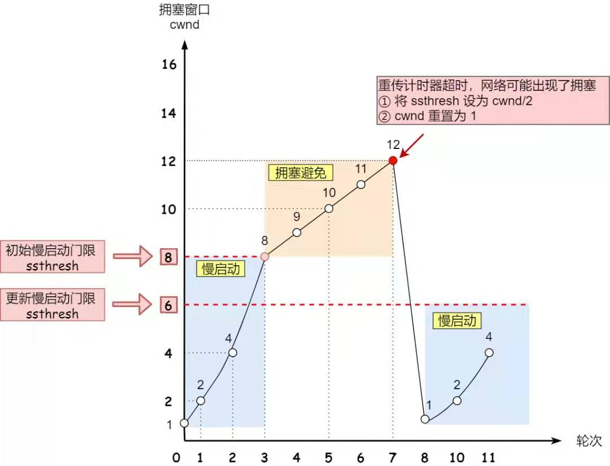
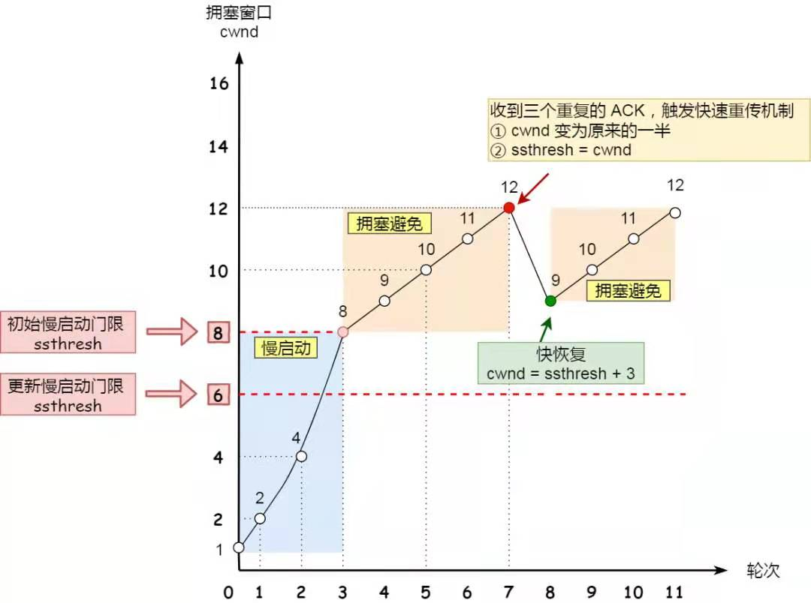

## TCP四个计时器

**重传计时器(Retransmission Timer)：**

**目的**：为了控制丢失的报文段或者丢弃的报文段。这段时间为对报文段的等待确认时间。
**创建时间**：在TCP发送报文段时，会创建对次特定报文段的重传计时器。
可能发生的两种情况：在截止时间（通常为60秒）到之前，已经收到了对此特定报文段的确认，则撤销计时器；在截止时间到了，但为收到对此特定报文段的确认，则重传报文段，并且将计时器复位。
**重传时间**：2*RTT（Round Trip Time，为往返时间）

---

**坚持计时器(Persistent Timer)：**

**目的**：主要解决零窗口大小通知可能导致的死锁问题
死锁问题的产生：当接收端的窗口大小为0时，接收端向发送端发送一个零窗口报文段，发送端即停止向对端发送数据。此后，如果接收端缓存区有空间则会重新给发送端发送一个窗口大小，即窗口更新。但接收端发送的这个确认报文段有可能会丢失，而此时接收端不知道已经丢失并认为自己已经发送成功，则一直处于等待数据的状态；而发送端由于没有收到该确认报文段，就会一直等待对方发来新的窗口大小，这样一来，双方都处在等待对方的状态，这样就形成了一种死锁问题。如果没有应对措施，这种局面是不会被打破的。为了解决这种问题，TCP为每一个连接设置了坚持计时器。
**工作原理**：当发送端TCP收到接收端发来的零窗口通知时，就会启动坚持计时器。当计时器的期限到达时，发送端就会主动发送一个特殊的报文段告诉对方确认已经丢失，必须重新发送。【这个特殊的报文段就称为探测报文段，探测报文段只有1个字节的大小，里边只有一个序号，该序号不需要被确认，甚至在计算其他部分数据的确认时该序号会被忽略。】
**截止期的设置**：设置为重传时间的值。但如果没有收到接收端的响应，则会发送另一个探测报文段，并将计时器的值加倍并复位，直到大于门限值（一般为60秒）。在此之后，发送端会每隔60秒发送一个探测报文段，直到窗口重新打开。

---

**保活计时器(Keeplive Timer)：**

**目的**：主要是为了防止两个TCP连接出现长时间的空闲。当客户端与服务器端建立TCP连接后，很长时间内客户端都没有向服务器端发送数据，此时很有可能是客户端出现故障，而服务器端会一直处于等待状态。保活计时器就是解决这种问题而生的。
**工作原理**：每当服务器端收到客户端的数据时，都将保活计时器重新设置（通常设置为2小时）。过了2小时后，服务器端如果没有收到客户端的数据，会发送探测报文段给客户端，并且每隔75秒发送一个，当连续发送10次以后，仍没有收到对端的来信，则服务器端认为客户端出现故障，并会终止连接。

---

**时间等待计时器(Time_Wait Timer)：**

**目的**：时间等待计时器是在连接终止期间使用的。

当TCP关闭连接时并不是立即关闭的，在等待期间，连接还处于过渡状态。这样就可以使重复的FIN报文段在到达终点之后被丢弃。

**时间设置**：一般为报文段寿命期望值MSL(Maximum Segment Lifetime)的2倍。

#### UDP包最大值

以太网EthernetII最大的数据帧是1518Bytes

刨去以太网帧的帧头（DMAC目的MAC地址48bits=6Bytes+SMAC源MAC地址48bits=6Bytes+Type域2Bytes）14Bytes和帧尾CRC校验部分4Bytes那么剩下承载上层协议的地方也就是Data域最大就只能有1500Bytes这个值我们就把它称之为MTU。

UDP 包的大小就应该是 1500 - IP头(20) - UDP头(8) = 1472(Bytes)

鉴于Internet(非局域网)上的标准MTU值为576字节，所以建议在进行Internet的UDP编程时，最好将UDP的数据长度控制在548字节 (576-8-20)以内

## 三次握手&四次挥手

* ACK位除了**主动打开的SYN**（一般是client）报文，皆为1，皆有
* ack永远为上一个收到报文的seq+1
* seq永远为上一个收到报文的ack

## 重传机制

* **超时重传**

  超过RTO（Retransmission Timeout）未得到确认则重传

* **快速重传**

  以**数据**为驱动而非**时间**，连续收到3个重复ACK则立即重传

* **SACK（Selective Acknowledge）**

  **快速重传**不知道该重传之前的**一个**还是**所有**

  在TCP头部选项字段加入SACK，将**缓存的地图**发送给发送方

* **D-SACK（Duplicate SACK）**

  使用SACK告诉对方哪些数据已经被**重复接收**了

## 拥塞控制

#### 慢启动

初始化`cwnd`一个`MSS`大小，每收到一个ACK则**翻倍**，指数增直到`cwnd == ssthresh`

#### 拥塞避免

当`cwnd`超过ssthresh(slow start threshold)后，每收到一个ACK则**+1**，线性增长

#### 拥塞发生

当发生「超时重传」：

```python
ssthresh = cwnd/2
cwnd = 1
// 进入慢启动
```



当发生「快速重传」则使用「快速恢复」:



#### 快速恢复

```python
ssthresh = cwnd
cwnd = ssthresh + 3 // 收到3个重复ACK
// 进入拥塞避免
```

## Nagle算法

* 上一个分组**得到确认**才会发送下一个分组
* 整合**长度小于SMSS**的数据到一个报文段

* 与**延时ACK**会发生死锁（非永久），需关闭Nagle，大多数交互式应用都如此

## 粘包

#### 原因:

* **多个进程**公用一个**TCP连接**，多种**不同数据结构**进行流式传输，边界分割会有问题
* **数据包**过大超过**发送区缓存**大小，一部分已经发送并**被接收**，一部分可能才**刚放进**发送缓存区
* 接收方**不及时接收**缓冲区的包，造成多个包的接收
* 流量控制，拥塞控制
* Nagle算法导致

#### 解决：

* 关闭Nalge
* **TCP头部**加上**数据长度**
* **应用层**自己解决

## HTTP over TSL

```sequence
	Client -> Server:"client hello",字符串cr\n可用的加密算法和压缩算法,TLS版本,
	Server -> Client:"server hello",字符串sr\n所用加密算法和压缩算法,证书及其公钥
	Client -> Client:验证证书\n有问题则警告用户
	Client -> Server:证书公钥加密后的随机\n字符串pr
	Server -> Server:私钥解密prandom\n根据cr,sr,p\n生成对称主密钥
	Client -> Client:根据cr,sr,pr生成对称主密钥KEY
	Client -> Server:KEY加密的"finished"
	Server -> Server:生成hash\n查是否对应
	Server -> Client:KEY加密的"finished"
```

## 浏览器输入网址到获得页面过程

* 浏览器缓存中查找DNS
* 操作系统缓存中查找DNS
* 检查本地域名解析文件`hosts`是否有
* 向**本地域名服务器**发起DNS请求
* 本地DNS服务器没有，检查本地DNS服务器缓存
* **本地DNS服务器**访问**根域名服务器**递归查询
* 浏览器获得域名对应的IP地址以后，浏览器向服务器请求建立链接，发起TCP三次握手
* TSL握手
* 服务器根据请求进行处理计算，将结果返回给浏览器
* 浏览器解析，遇到静态资源引用则继续向服务器请求这些资源
* 渲染界面