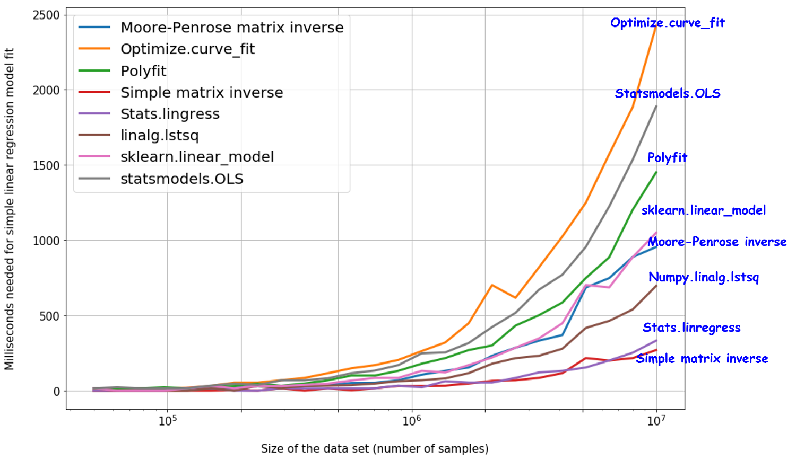

# Scikit-learn
### Interpolation&Fitting&Regression
* #### Interpolation
method = ["nearest","zero","slinear","quadratic","cubic"]
##### 1D interpolate
```  
f = scipy.interpolate.interp1d(x,y,kind=method)
ynew = f(xnew) #xnew为要插值的点
```  
##### 外推UnivariateSpline
```
scipy.interpolate.UnivariateSpline(x,y,w=None,bbox=[None,None],k=3,s=None)
```
x,y是X-Y坐标数组  
w是每个数据点的权重值  
k为样条曲线的阶数(1<=k && k<=5)  
s为平滑参数
s=0，样条曲线强制通过所有数据点
s>0,满足∑(w(y−spline(x)))2≤s
#### 2D interpolate
```
x,y=np.mgrid[-1:1:8j,-1:1:8j]
z=func(x,y)
func=interpolate.interp2d(x,y,z,kind='cubic')
xnew=np.linspace(-1,1,100)
ynew=np.linspace(-1,1,100)
znew=func(xnew,ynew)#xnew, ynew是一维的，输出znew是二维的
xnew,ynew=np.mgrid[-1:1:100j,-1:1:100j]#统一变成二维，便于下一步画图
```
#### 散乱点
```
func=interpolate.Rbf(x,y,z,function='multiquadric')
```

* #### Fitting
```
p = numpy.polyfit(x,y,k)
p = scipy.polyfit(x,y,k)
```


* #### Regression
```
lrmodel = sklearn.linear_model.LinearRegression(fit_intercept=True,normalize=False)
lrmodel.fit(x,y)   #x,y 皆为列向量，即x一行为一个样本
print(lrmodel.coef_) #打印系数
print(lrmodel.intercept_) #打印常系数
lrmodel.predict([[1,2,3],[2,0,7]]) #预测值Pre_x为与原x同shape
```
fit_intercept: 布尔型	默认true	是否对训练数据进行中心化。如果该变量为false，则表明输入的数据已经进行了中心化，在下面的过程里不进行中心化处理；否则，对输入的训练数据进行中心化处理  
normalize: 布尔型	默认false	是否对数据进行标准化处理  
copy_X	布尔型	true	是否对X复制，如果选择false，则直接对原数据进行覆盖。（即经过中心化，标准化后，是否把新数据覆盖到原数据上）  
n_jobs	整型	1	计算时设置的任务个数(number of jobs)。如果选择-1则代表使用所有的CPU。对于 n_targets>1 且足够大规模的问题有加速作用。

### Decomposition
* #### PCA:
```
skl.decomposition.PCA(n_components=None, copy=True, whiten=False)   
```
n_components:保留主成分个数(设为'mle'自动选择)  
copy: 为True时在原数据上修改  
whiten: 是否白化  
用pca.fit(x,y=None)+pca.transform(x)  
或pca.fit_transform(x)得到结果  
pca.explained_variance_ratio_得到已经选择的特征百分比

### Cluster
* #### KMeans
```
sklearn.cluster.KMeans(
    n_clusters=8,
    init='k-means++',
    n_init=10,
    max_iter=300,
    tol=0.0001,
    precompute_distances='auto',
    verbose=0,
    random_state=None,
    copy_x=True,
    n_jobs=1,
    algorithm='auto'
    )
```
n_clusters:  
簇的个数，即你想聚成几类  
init:  
初始簇中心的获取方法  
n_init:  
获取初始簇中心的更迭次数，为了弥补初始质心的影响，算法默认会初始10次质心，实现算法，然后返回最好的结果  
max_iter:  
最大迭代次数（因为kmeans算法的实现需要迭代）  
tol:  
容忍度，即kmeans运行准则收敛的条件  
precompute_distances：
是否需要提前计算距离，这个参数会在空间和时间之间做权衡，如果是True 会把整个距离矩阵都放到内存中，auto 会默认在数据样本大于featurs*samples 的数量大于12e6 的时候False,False 时核心实现的方法是利用Cpython 来实现的  
verbose:  
冗长模式（不太懂是啥意思，反正一般不去改默认值）  
random_state:  
随机生成簇中心的状态条件  
copy_x:  
对是否修改数据的一个标记，如果True，即复制了就不会修改数据。bool 在scikit-learn 很多接口中都会有这个参数的，就是是否对输入数据继续copy 操作，以便不修改用户的输入数据。这个要理解Python 的内存机制才会比较清楚。  
n_jobs:  
并行设置  
algorithm:  
kmeans的实现算法，有：’auto’, ‘full’, ‘elkan’, 其中 ‘full’表示用EM方式实现
```
kms = KMeans(n_clusters=2)
kms.fit(x)                  #或者kms.fit_predict(x)
print(kms.labels_)          #聚类标签
print(kms.cluster_centers_) #聚类中心
print(kms.inertia_)         #聚类准则的总和
```
